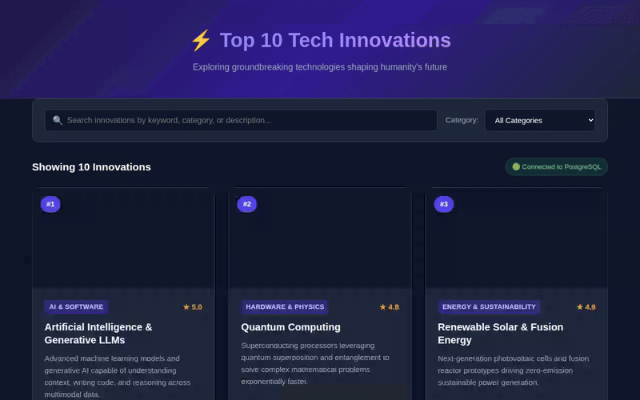

# WEB103 Project 2 - *Top 10 Tech Innovations*

Submitted by: **CodePath Student**

About this web app: **A data-driven listicle web application showcasing the Top 10 Tech Innovations shaping humanity's future. Built strictly with vanilla HTML, CSS, and JavaScript on the frontend (no frameworks) and backed by a PostgreSQL database connected via a Node.js/Express REST API.**

Time spent: **6** hours spent in total

## Required Features

The following **required** functionality is completed:

- [x] **The web app uses only HTML, CSS, and JavaScript without a frontend framework**
- [x] **Data is supplied to the app using a Render / PostgreSQL database**
- [x] **The web app is connected to a Render / PostgreSQL database**
- [x] **The database contains an appropriately structured table for the list items**

The following **stretch** features are implemented:

- [x] **Users can search for items with a specific attribute**

The following **additional** features are implemented:

- [x] Category filter dropdown for instant category-based item refinement
- [x] Item detail modal view displaying extended information and ratings
- [x] Database reset and seeding script (`npm run reset`)
- [x] Detailed 6-tier architectural call stack traces documented in `ARCHITECTURE.md` and `docs/plans/listicle-pt2/03-program-design.md`

## Video Walkthrough

Here's a walkthrough of implemented user stories:

GIF created with Playwright and FFmpeg.

## Architecture & System Design

For full technical specifications, directory layout, and 6-tier granular call stack execution diagrams (Project, Folder, File, Class/Module, Method/Route, State/Variable Mutability), see:
- [`ARCHITECTURE.md`](./ARCHITECTURE.md)
- [`docs/plans/listicle-pt2/03-program-design.md`](./docs/plans/listicle-pt2/03-program-design.md)

## Notes

- **Database Setup & Seeding:** PostgreSQL table creation and seeding are automated using `npm run reset`, which resets and populates the `items` table with 10 tech innovation items.
- **Search Query Execution:** Search capability uses SQL `ILIKE` via `GET /api/items?q=...` to filter items dynamically across title, description, and category.

## License

Copyright [2026] [CodePath Student]

Licensed under the Apache License, Version 2.0 (the "License");
you may not use this file except in compliance with the License.
You may obtain a copy of the License at

    http://www.apache.org/licenses/LICENSE-2.0

Unless required by applicable law or agreed to in writing, opacity or conditions of any kind, either express or implied.
See the License for the specific language governing permissions and limitations under the License.
